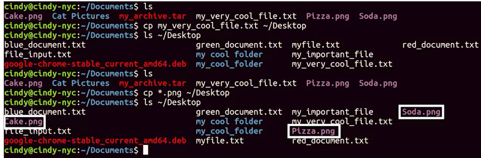
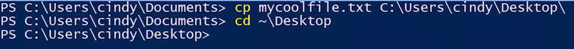
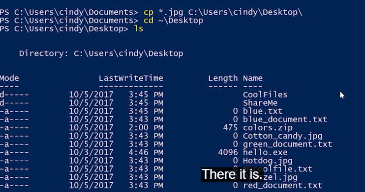

## Copy File
in Bash use ***cp*** command to copy a file 
```Bash
cp <sourcePath\file> <destinationPATH>
```
we can use wildcard by copying:
```bash
cp *.png ~\Desktop
```
## Copy a Directory in Linux
 If we want to copy over directory, we have to recursively copy over the directory to get all the contents. The flag for recursive copy is -r. If I want to copy over my cat pictures folder to the desktop, I could do something like this.


In Powershell, the command used to copy something is CP. We also need to add a file that we want to copy and the path of where we want to copy it to. 

---


---
```PowerShell
cp <sourcePath\file> <destinationPATH>
```


### Wildcards
use something called the wildcard to help me copy over multiple files at once. A wildcard is a character that's used to help select files based on a certain pattern

Asterix_Symbol " * " means anything, anytimes that matches. 

```PowerShell
cp *.jpg ~\Desktop
```



## Copying a Directory

***cp*** commandy just copies an empty directory; to copy a directry with its content we must use it with Recurse flag, ***-Recurse***
```PowerShell
cp  "MyCoolDirectory" ~\Desktop -Recurse
```

***-Verbose***
With -Verbose flag copy does'nt output anything in the CLI by default until there are erors. 
```PowerShell
cp "MyCoolDirectory" ~\Desktop -Verbose -Recurse
```

