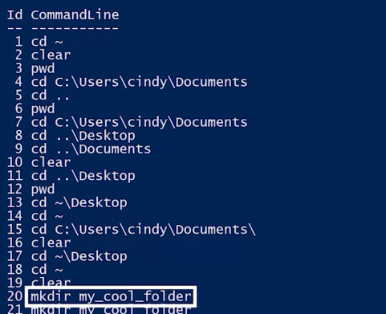

```PowerShell
history
```



We can scroll through these commands with the up or down keys on our keyboard. 

You can even search through your previously used commands using the history shortcut, Ctrl-R. From here, you can start typing bits and pieces of the command you want to look for and I'll show you matches.

If you're using an older version of PowerShell, it may not have the Ctrl-R feature. If that's the case, you can type the pound ( #) symbol followed by some part of your old command and then use tab completion to cycle through the items in your history.

to clear the screen: 

```PowerShell
clear
```

```Bash
history
```

The exact same history command that's used in Windows is used in Linux. From here, we can use our up and down keys and even search through our history with Control R. To clear your terminal up, what do you think you do? That's right. The clear command.

```Bash
clear
```