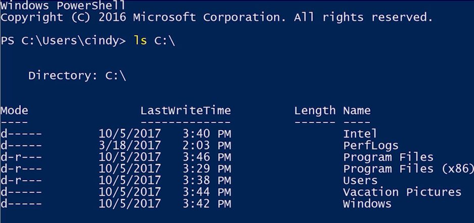

The command line interfaces or CLIs available on Windows are: 

+ Command Prompt: cmd.exe
+ Power Shell   : powershell.exe

 Many PowerShell commands that we'll use are actually aliases for common commands in other shells. An alias is sort of like a nickname for a command.

The C drive is where the Windows operating system is installed.

ls command list directories under working-directory. For example : The C drive root folder is what we call a parent directory and the contents inside are considered child directories. Parents and children are common terms that stand for hierarchical relationships in OSs. 

to get information about and examples of a comand we use ***Get_Help <command>***

***
'''PowerShell
Get-Help ls 
'''
***

