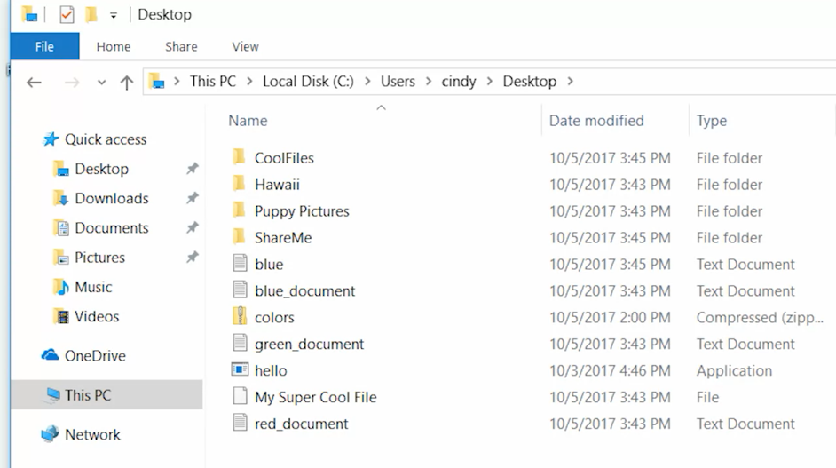

# List Directories in a GUI 

In OS, files and folders or directories are organized in a hierarchical directory tree. 
We call the location of these files and directories paths. Most paths in Windows look something like this, 
```
C:\User\Cindy\Desktop. 
```

In Windows, file systems are assigned to drive letters which look like C or D or X, each drive letter is a file system, remember that file systems are used to keep track of files on our computer. 

Each file system has a root directory which is the parent for all other directories in that file system. So the root directory of c would be written **C\:**, and the root directory of **X** would be written **X\:**. !!!


Sub directories are separated by backslash("\\") is unlike Linux which uses forward slashes("/"). A path starts at the root directory of a drive, and continues to the end of the path. Let's open up this PC, and navigate to our main directory, 
the main directory in a Windows system is the drive that the file system is stored on. In this case, our file system is stored on **Local Disk C**.
 If we look at the top here, you can see the path, 
 
***

***

There are also some files on here that you can't see: 
Hidden files : We'll go to the top and click View, then check the Hidden Items check box. Now we can see all the hidden files on our system, 
***

***
```
View Tab --> "Hidden Items"-CheckBox
```
Now how to view information about a file? Well, to do this, we can actually just right click and choose Properties.
*** 

***
in the General tab, we can see the file name, the Type of File, and the location path of the file, which is **C:\Users\Cindy\Desktop**. Then we have the size of the file, and the Size on disk, this can be a little confusing. The size of the file is actually the amount of data that it takes up, but Size on Disk is a little different. Next you have timestamps of when the file was Created, last Modified and last Accessed. After that our file attributes we can enable for our file, we have Read-only and Hidden, you might guess that if you check hidden, our file will be hidden and only visible if we enable Show Hidden Items. There are some advanced options too, but we won't touch those for now. 
a few other tabs here at the top, Security, Details and Previous Versions. The Previous Versions tab lets us restore an earlier version of a file. So if you made a change to a file, and wanted to revert to that change, you could go back to that version. So to sum up listing their directories in the Windows gooey, we can see the list of files and folders by default here. You can even change how you want to view them using icons, or even a list. Then if you wannna get more information about a file, you can look at its properties. 
***

***
Next up, let's see how to view all this information through the Windows CLI.

```
View Tab --> "Hidden Items"-CheckBox
```