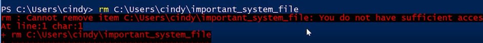
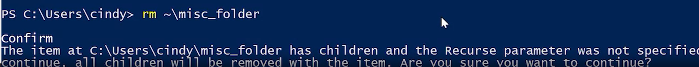

In PowerShell the command to remove files and directories is rm or remove. Take caution when using remove because it doesn't use the recycle bin. Once the files or directories are removed they're gone for good.

---
```PowerShell
rm ~\text1.txt
```

The remove command might seem like a dangerous weapon in the wrong hands. Fortunately, there are safety measures in place that only give this ability to users that are actually authorized to use it. 



I get an error message saying that I don't have permission to delete this file. In some cases like this one, it's because it's been marked as a system file. In other cases it might be because I don't have enough permissions in the file system to remove the file. I do have the right permissions this time, but since it is important file, PowerShell wants to make sure that I meant to do this. If I repeat the command with the -Force parameter, remove will go ahead and remove the file.

If the file belongs to someone else, or if I'm not an administrator, then I might not have the right permissions to remove the file. In that case, I'll need to access an administrator account to remove the file. 

Since this is in the directory, it contains other files and we do not use the -Recurse parameter. 



We see a prompt asking us to confirm if we really want to remove the directory and all its contents. We can say Yes or Yes to All, to continue. We can also cancel this command and run it again with the -Recurse parameter. That way, PowerShell knows that we understand the consequences of what we're doing.