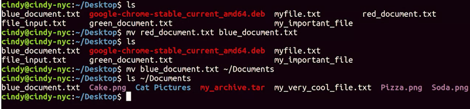
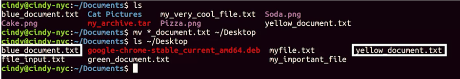
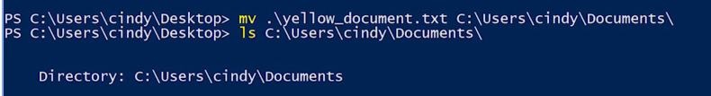

# Moving and Renamig

***mv*** command can be used for Linux. mv or move can rename and move files and directories. Same thing applies here. I'm going to move my red document and rename it to blue document. Now we can see it's been renamed to blue document. Then I'm going to move the blue document into the Documents folder. 

---
```bash
mv .\red_document.txt .\blue_document.txt
```


 Using wildcards we can move multiple files at once, just like Windows. Let's move all that underscore document files here to our Desktop. Now if we check the Desktop, there they are.
```bash
mv *_document.txt ~/Desktop
```



While in the Windows GUI, if you wanted to rename a file, we just right-click and rename. 

In the command line if we wanted to rename a file, we can use the move or move item command. It lets us rename files. Let's move the file without changing the directory that it's stored in. On my desktop here I have blue document and I'm going to move or rename it two yellow document. 

---
```PowerShell
mv .\blue_document.txt .\yellow_document.txt
```


Now you can see that I have a yellow document. 

As you might guess, the move command also lets us move files from one directory to another. 

---
```PowerShell
mv *_document.txt C:\Users\selim\Douments\
```


You can even move multiple files by using wildcards. Now you can see the rest of my colored documents went into my documents.

