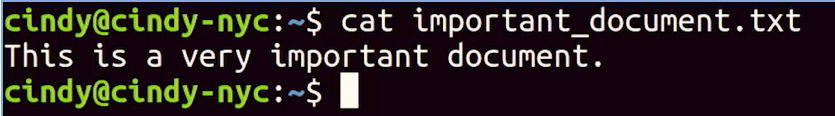
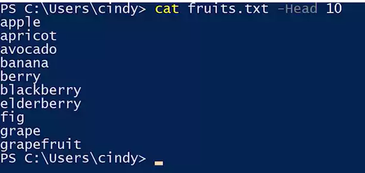
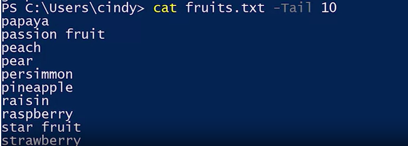
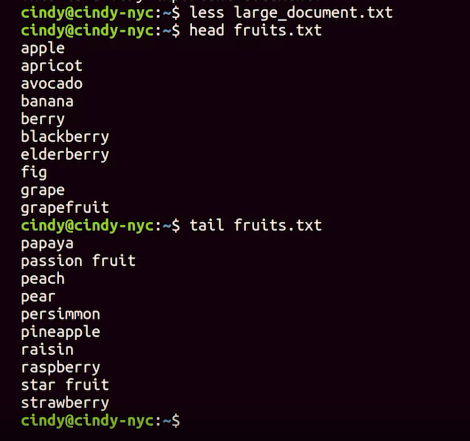

In windows we can see the content of a file by double-clicking on it. 
To Change the default program, with that we open the file, 
    - Right clicj on the file 
    - Change the "open with" choice, 


***cat*** command lets us display the content of text_files. 

``` PowerShell
    // cat stands for concatanet the text
    cat importent.txt
```

- with ***Enter*** we can go line by line
- with ***space*** we can go page by page
-with ***cat <fileName.txt> --Head 10*** we can see the first 10 lines of a file . 

-with ***cat <fileName.txt> --Tail 10*** we can see the last 10 lines of a file . 



in Linux ***less*** commands makes mor than ***more*** command. 
- We can with page_up and page_down go up and down; 

- with ***"g"*** we can go to the beginning of the file; 
- with ***"G"*** we can go to the end of the file. 
- with *** /<word_to_search>*** we can search a word or phrase  in the text. 
- with ***"q"*** we can go out of ttext. 
``` Bash
    // less to see page for pages. 
    less importent.txt
```


***more** lets us see  one page one a time 
``` PowerShell
    // more to see page for pages. 
    more importent.txt
```

***head*** lets us see  first 10 line of the file. We can give the number of lines with ***"-n"*** flag. 
``` PowerShell
    // head to see first lines of the page. 
    head importent.txt
```
***tail*** lets us see  last 10 line of the file. We can give the number of lines with ***"-n"*** flag. 
``` PowerShell
    // tail to see last lines of the page. 
    tail importent.txt
```


