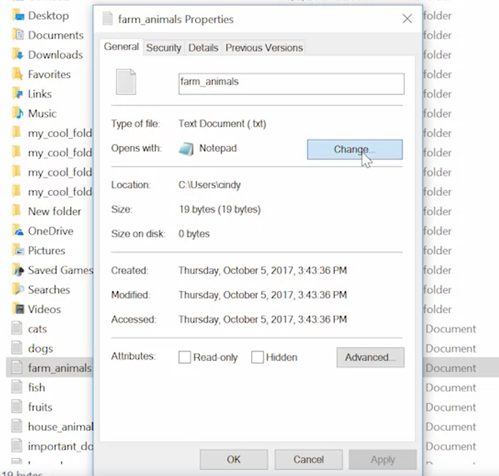

In windows we can see the content of a file by double-clicking on it. 
To Change the default program, with that we open the file, 
    - Right clicj on the file 
    - Change the "open with" choice, 



***cat*** command lets us display the content of text_files. 
``` PowerShell
    // cat stands for concatanet the text
    cat importent.txt
```
***more** lets us see  one page one a time 
    // more to see page for pages. 
    more importent.txt


***head*** lets us see  first 10 line of the file. We can give the number of lines with ***"-n"*** flag. 
    // head to see first lines of the page. 
    head importent.txt

***tail*** lets us see  last 10 line of the file. We can give the number of lines with ***"-n"*** flag. 
    // tail to see last lines of the page. 
    tail importent.txt