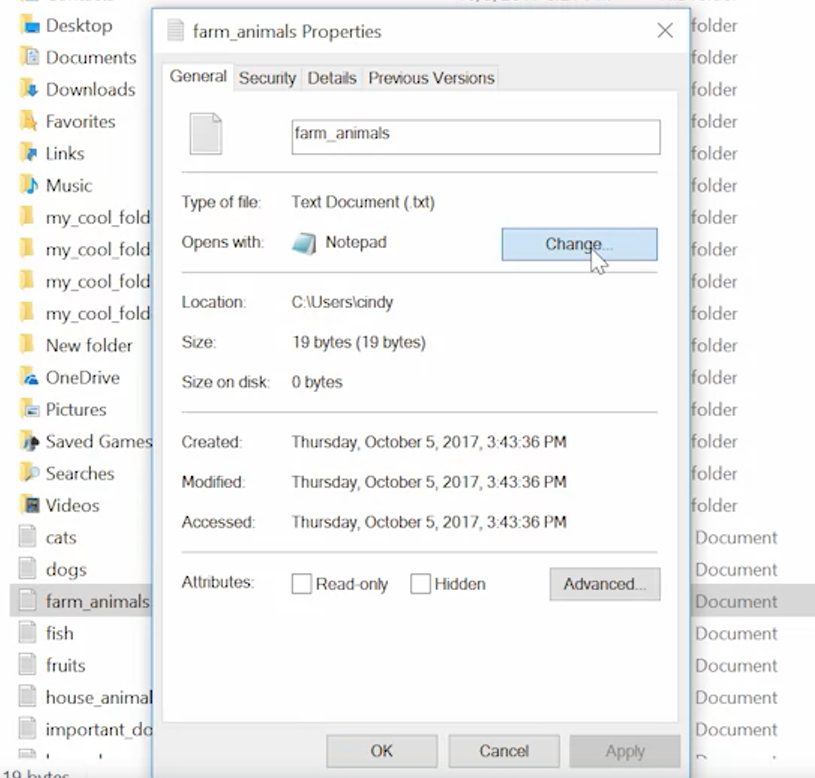

In windows we can see the content of a file by double-clicking on it. 
To Change the default program, with that we open the file, 
    - Right clicj on the file 
    - Change the "open with" choice, 

