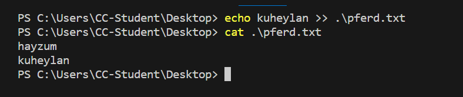

# stin, stout, sterror
In PowerShell, the echo is actually an alias for ***Write-Output***.  We know the echo command prints out our keyboard input to the screen. 


Every Windows process and every PowerShell command can take ***input*** and can produce ***output***. To do this, we use something known as ***I/O streams or input/output streams***. 

Each process and Windows has three different streams:
- standard in, 
- standard out, and 
- standard error

 It's helpful to think of these streams like actual water streams in a river. we provide input to a process by adding things to the standard instream, which flows into the process. When the process creates output, it adds data to the standard out stream, which flows out of the process.
 
At the CLI, the input that we provide through the keyboard goes to the standard instream of the process that we're interacting with. This happens whether that's PowerShell, a text editor or anything else. The process then communicates back to we by putting data into the standard out stream, which the CLA writes out on the screen that we're looking at. 

### Redirection and Appending Operator ">>" changes "where standart-output goes"

Now, what if instead of seeing the output of the command on the screen, we want it to save it to a file. The ***greater than symbol ">"*** is something we call a ***redirector operator*** that *lets us change where we want our standard output to go*. Instead of sending standard out to the screen, we can send standard out to a file. If the file exists, it will override it for us. Otherwise, it will make a new file. 

If we don't want to overwrite an existing file, there's another redirect or operator we can *use to append information* ***greater than, greater than">>"***. Let's see that in action. Echo kuheylan>> dog.txt. Now if I look at mpferd.txt file again, we can see that woof was added again. 



# Pipelinining (Output of a command is Input another) , "|" Pipe_operator

But what if we wanted to send the output of one command to the input of another command. 
For this, we use the pipe operator. First, let's take a look at what's in a file. 

```PowerShell
cat .\pferd.txt
```

Look at that, it's a list of words. Now what if we want to just lift the words that contain the string "hay"? We could do what we've done before and just use the ***Select-String*** or SLS on the file directly. This time, use the pipeline to pass the output of cat to the input of Select-String, cat, pfred.txt, pipe, select-string hey. 


Now we can see a list of words with the string "hay". To tie things together, we can use output redirection to put our new list into a file. Now greater than and then a new file called hay_words.txt. 


the last I/O redirector is standard error. 
For example we tried to remove a restricted system file earlier and we got an error that said permission denied. LWenn we trat to remove another protected file, 

```PowerShell
rm secure_file
```


We see errors like we're supposed to. 

But what if we didn't want to see these errors? It turns out we can just redirect the output of error messages in a different output stream called ***standard error***. The redirection operator can be used to redirect any of the output streams, but *we have to tell it which stream to redirect*. Let's type rm secure_file 2>errors.txt.

```PowerShell
rm secure_file 2>errors.txt.
```
If I look at errors.txt, I can see the error message that we just got. 


All of the output streams are numbered. One is for ***standard out***, which is the output that you normally see, and two is for ***standard error*** or the error messages. 
 

 
When we use two greater than, we're telling PowerShell to redirect the standard error stream to the file instead of standard out. What if we don't care about the error messages, but we don't want to put them in a file? Using our newly learned redirect or operators, we can actually filter out these error messages. 


In PowerShell, we can do this by redirecting standard error to ***#null***. "#null" is a special variable that contains the definition of nothing. You can think of it as a black hole for the purposes of redirection. Let's redirect the error messages this time to ***#null*** : 

```PowerShell
rm secure_file 2> $null
```

Now our output is filtered from error messages. To learn much more use Get-help about_redirection in PowerShell to see more detail. 