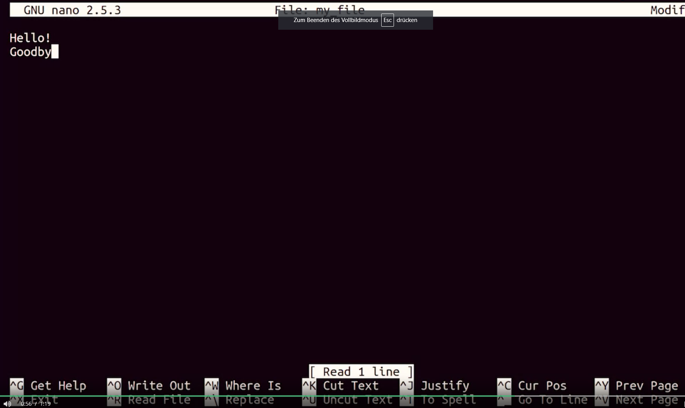
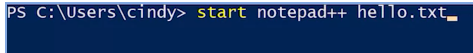
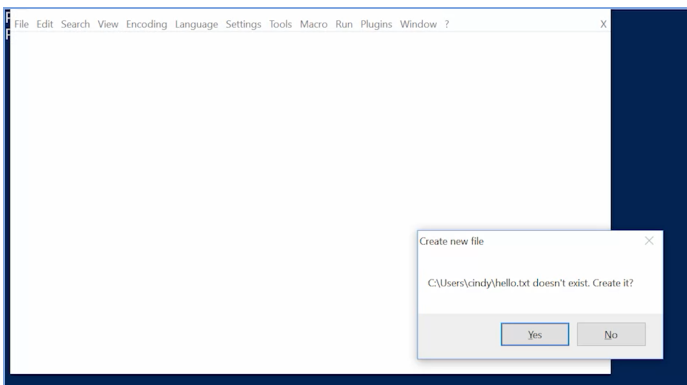

In Linux there are many text editor;
nano is a usefull and light-weight text editor. 
To save --> ctrl+O
To exit --> ctrl+X

For windows ***Notepad** is an opensource text editor. 
***Notepad++***  has more featurees; lets Syntaxhighlighting. 
We can edit a text file y right click on it and selecting notepad++ .

In Powershell there is no a default text editor;
But a text editor for Powershell we can install  ***Notepad++*** text editor and begin to edit a text file. 

