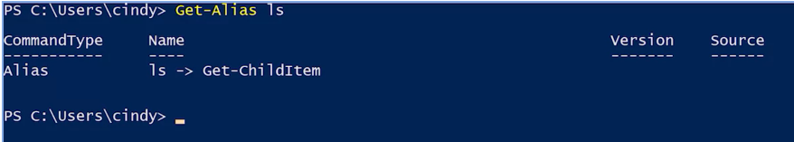
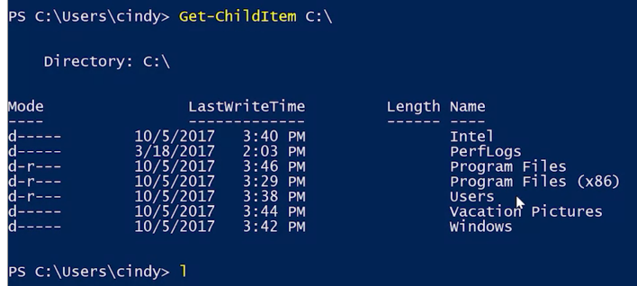
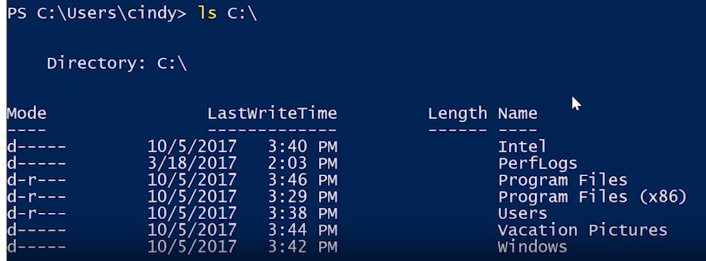

Tie get help for usage in powershell use Get-Help <command>. 

PowerShell uses also aliases; 
to see the aliases: 

``` poweShell
Get-Alias
```







Aliases for common commands are a great way to work more quickly in PowerShell.

In windows, you pretty much have three different ways you can execute commands:
- real PowerShell commands 
- or the relatable alias names
- cmd.exe commands : ommands. cmd.exe commands are commands from the old MSDOS days of Windows, but they can still be run due to backwards compatibility. Keep that in mind that they aren't as powerful as PowerShell commands.
cmd_exe_com

