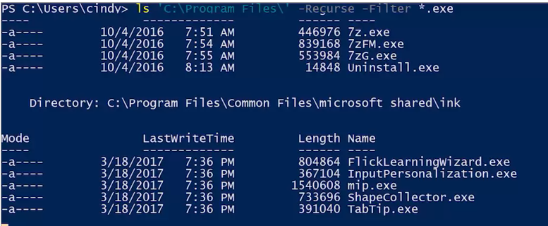
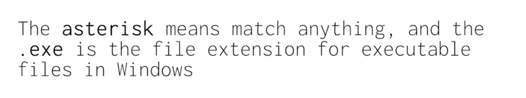

if we wanted to search for something ***-within a directory***-, like looking for just the executables in that same directory;  This is where the command parameter ***-Filter*** comes in. I'm just going to LS my program's files here with the ***--Recurse and -Filter***- and look for exe's.

The -Filter parameter will filter the results for file names that match a pattern. 
search_in_directory1

The asterisks mean match anything, and the .exe is the file extension for executable files in Windows. So the only results we're going to get are the files that end in .exe, .
search_in_directory2
