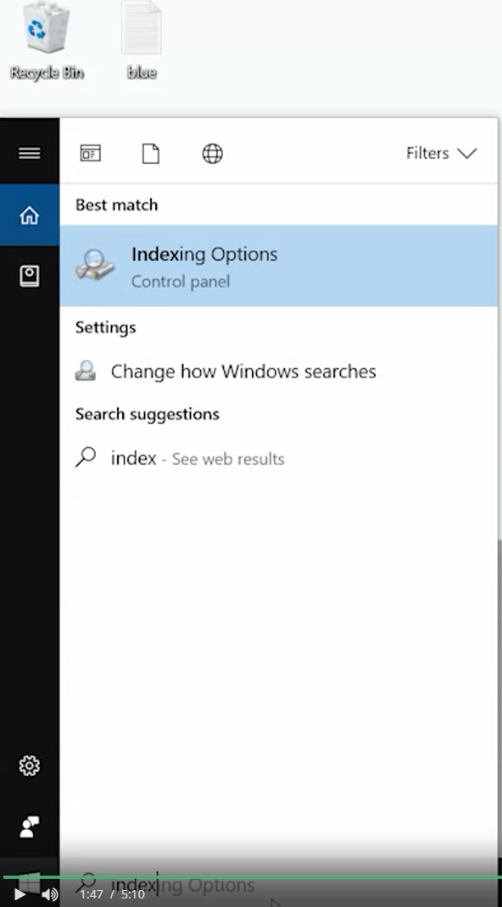
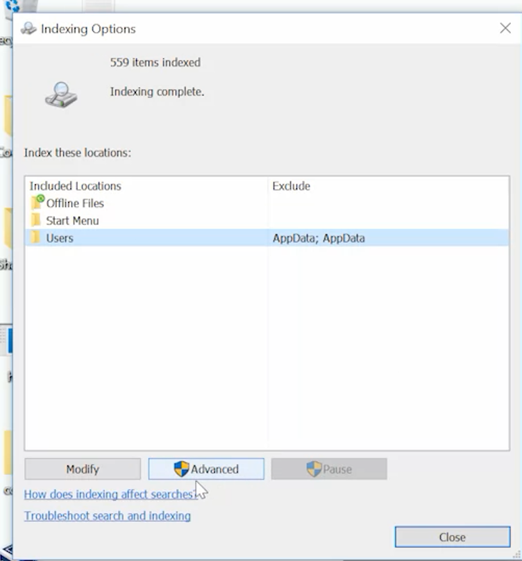
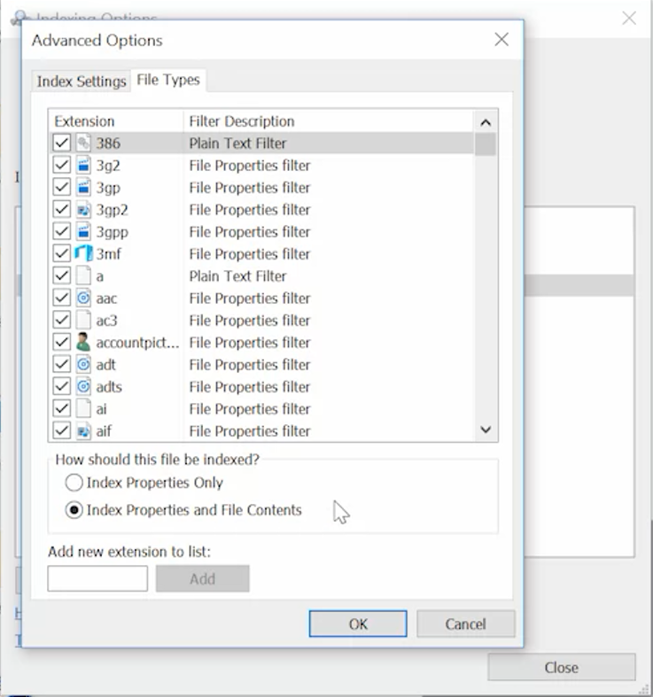
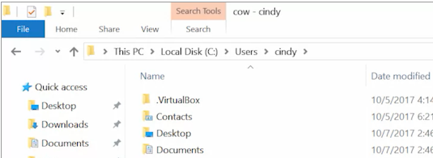
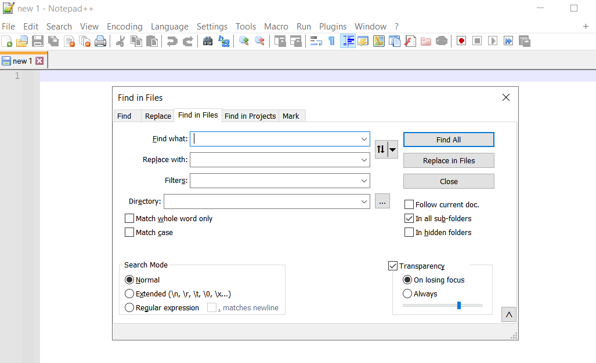
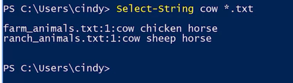

Wenn we need to search a word in a text , all we need to do is using ***CTRL+F*** . 
But what if we needt to search a word existing in multiple files. There are a few options: 

### Searching with GUI:

- Windows has a service called the ***Windows Search Service***. This service indexes files on your computer by looking through them on a schedule. It then compiles a list of names and properties of the file that it finds into a database, this is a time consuming and resource intensive process. So on many Windows servers though search service isn't installed or is disabled, on Windows 8 and Windows 10 desktop computers it's often enabled for files in your ***home directory***, but not for the ***entire hard drive***.By default, the Windows Search Service will let you find files based on their ***name, path, the last time they were modified, their size or other details***, 
***but by default you can't search for words inside the files***. 
The Windows Search Service can be configured to search file contents and their properties. This increases the amount of time that it takes for the indexer to do its work. It's sort of the computer is doing all the searches that you might want to do ahead of time and then you just have to look up the result.

Let's configure the service to index file contents and see what it looks like. The settings we're looking for in the Control Panel, but we can use the Start menu to find the settings we need faster.

Open the Start menu and then type indexing, you'll see the indexing options in your results of the search, click on that.

Now we want to change the settings for the user folder which is where all the home directories are stored. Select Users and then click Advanced.

Now select the File Types tab and select Index Properties and File Contents, click Ok

Now close out of the indexing options. When you do this, the Windows Search Service will start to rebuild the index based on your new settings. This could be super fast or it could take a while, it all depends on how many files you have and how large they are.

Now I can use Windows Explorer in my home directory to find files that have a specific word in them.

Let's search for the word cow. 

The results turn up farm animals and ranch animals.text, 

we can see the word cow in this text file. 

- If you don't want to use the Windows Search Service, we can also use Notepad++, the editor that we installed in an earlier lesson.

From Notepad++, press CTRL+SHIFT+ F to open the Find in Files dialog.

From here, we can specify what you want to find and what files you want to search. You can limit your search to a specific directory, to a specific set of file extensions and you can even optionally replace the word with another one from here. 

### Using CLI
- we can search for words within files from the command line. In PowerShell, we're going to use the ***sls*** or ***select desk string*** command to find words or other strings of characters and files. You can think of strings as a way for the computer to represent text. The Select-String command lets you search for text that matches a pattern you provide. This could be a word, part of a word, a phrase or more complicated patterns that are described using a pattern matching language called regular expressions. Keep in mind that this is a really powerful capability that we're just scratching the surface of. So here, we're going to search for a word in a file in my home directory. Let's search for the word cow again.

You'll see that Select-String found cow and it tells you the file and line number where it found it. 

if you wanted to search through several files in a directory, you can use pattern matching to select them. Remember the wildcard character asterisk for selecting all, we can use that here as well.

