# LINUX ADD USER & GROUP

To add a new user in Linux, you can use the user add command, s

``` bash
    sudo useradd ali
    sudo userdel ali 
```
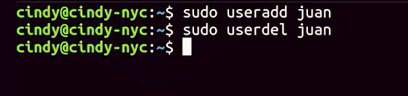
This will set up basic configurations for the user and set up a home directory.

You can combine this with the password command to make the user change their password on login. 

To remove a user, you can just use sudo userdelete juan.


# ADD USER & GROUP
``` Powershell
    net user cindy "some pass"
```
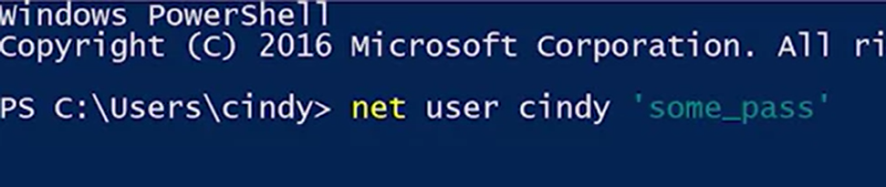


## GUI

To add a user we're going to go back to our computer management tool. Under local users and groups we're going to right click and select new user. 
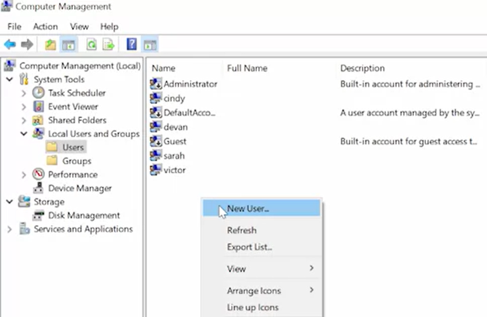

From here, it asked us to set a user name, a full name and a password. 

in order to use good password setting practices, we set a default password and then make the user change that password when they log in. 
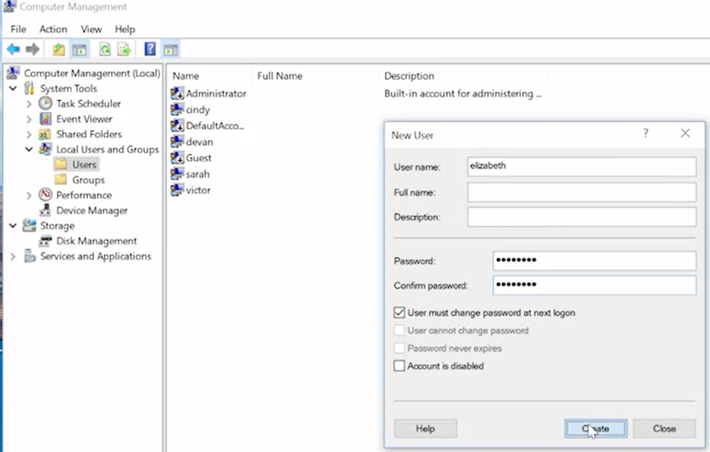


To remove a user we simply right click and select delete.
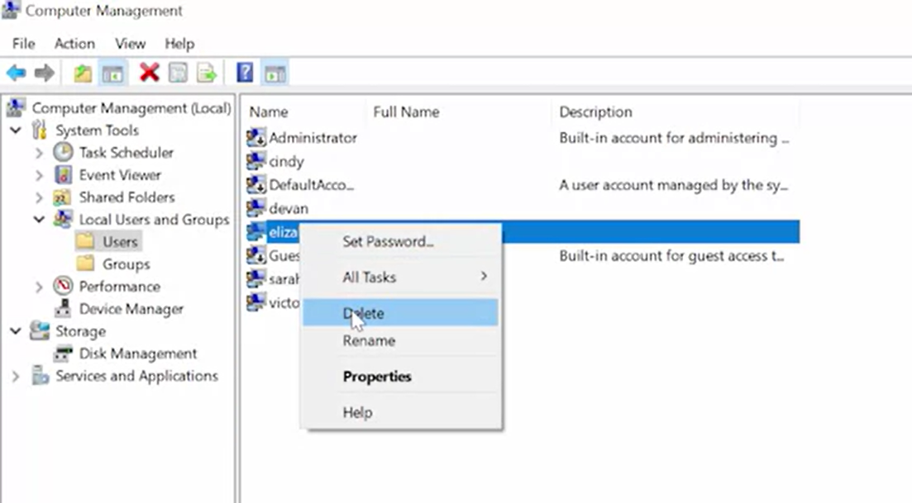

This gives us a warning message that says user names are unique. And even if you delete the user and give them the exact same user name, they won't be able to access their old resources. 

## CLI

use the same net command that we use to change passwords, just with different parameters. 

``` Powershell
    net user cindy * /add
```
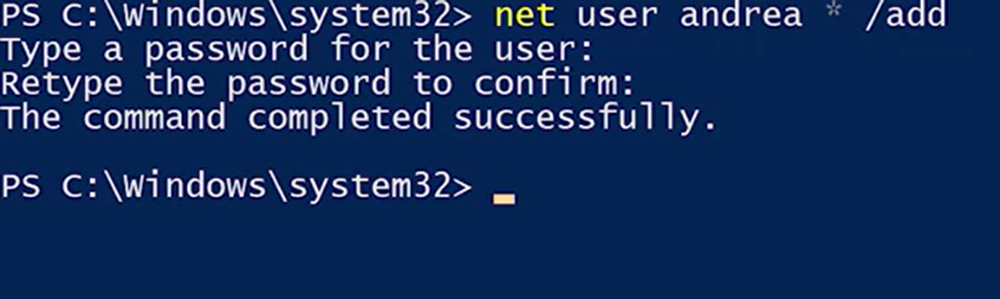

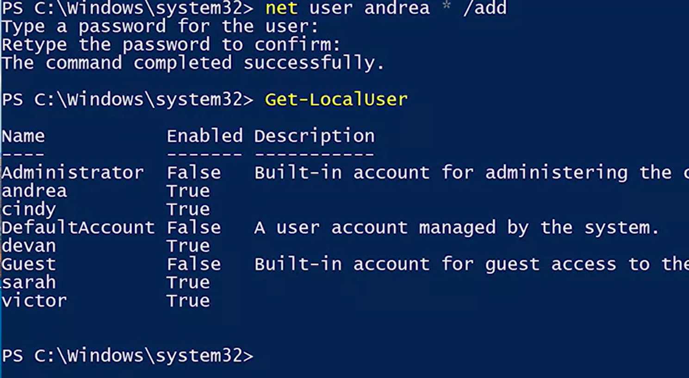

There's a native power shell command ***new*** dash local user that requires a little bit of scripting to use. 

We don't want to know what the password is because that means we can log in as User. We want to make sure the User changes her password to something that we don't know. So we're going to flag her account as requiring a password change, using the slash log on password change, yes parameter.

``` Powershell
    net user andrea /logonpasswdchg:yes
```
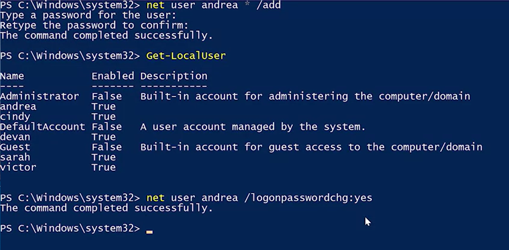

We can actually combine these two commands that we ran to create a new account that requires a password change at first login. 
``` Powershell
    net user andrea "passwd" /add /logonpasswdchg:yes
```
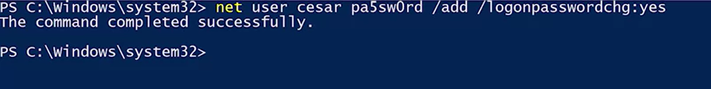


Let's delete Andrea's account. Net user andrea / delete.
``` Powershell
    net user andrea /del
```
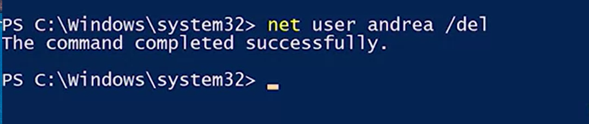

``` Powershell
    Remove-LocalUser ceaser
```
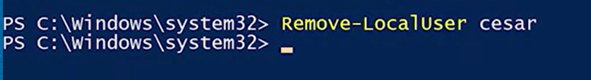
This will delete Andrea's account and using the Remove-LocalUser command, we can remove Cesar's account.
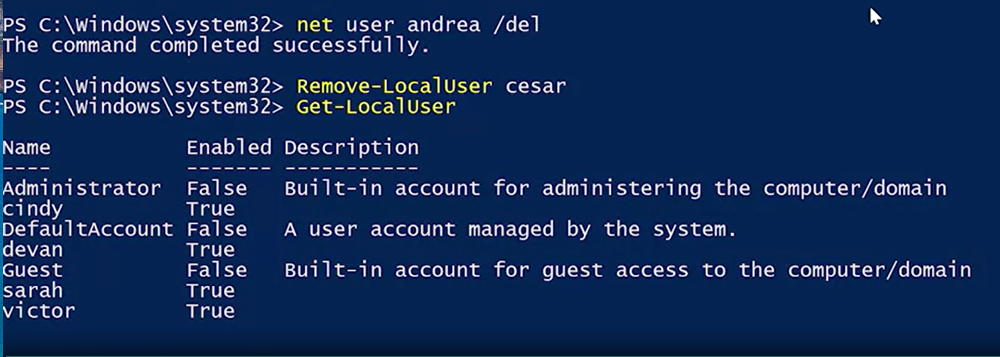

