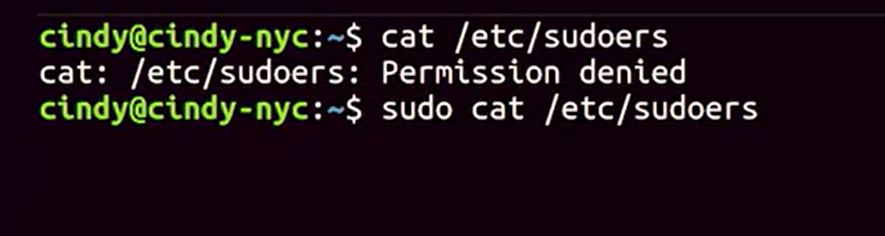
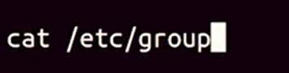
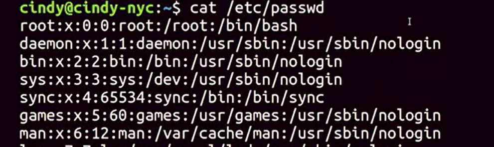

# LINUX USERS & GROUPS

``` Bash
    // list the groups on the local machine. 
    visudo
    cat /etc/sudoers

    cat /etc/passwd
    cat /etc/group

    cat /etc/shadow
```

different user types have different privileges and they can be grouped together with various access levels.

Root user has all the privileges on the OS, they're the super user. There's technically only one super user or root account, but anyone that's granted access to use their powers can be called a super user too. 


The sudoers file is a protected file that can only be read by root. 

But it can be really dangerous to always be in root. So instead of logging in its root, we can tell the shell that we want to run this one command as root;  on Linux we can do this with the sudo command, or superuser do. So sudo ***cat/etc/sudoers*** and now we're able to see the contents of this file.
``` Bash
    // list the groups on the local machine. 
    cat /etc/sudoers
```


To edit ***/etc/sudoers*** we can also use ***visudo*** command. 
``` Bash
    // list the groups on the local machine. 
    visudo
```
If you don't want to run sudo every time you need to run a command that requires ***/root privileges***/, you can just use the su command or substitute user. This will allow you to change to a different user, 

if you don't specify user, it defaults to root.

You can view who has access to run sudo by viewing the ***/etc/group***. 
``` Bash
    // list the groups on the local machine. 
    cat /etc/group
``` 



There are four fields here, separated by colons, the first field is the ***group name***. In this case, it's sudo, the second field is the ***group password.*** We don't really need to specify a group password, so it defaults to the root password. The x here means that the password has been encrypted, and stored in a separate file. 
The third field is the ***ID of the group***, or group ID.

When our operating system runs a task that involves a group, it uses a group ID Instead of a group name. 

And finally, the last field is a ***list of users in the group***. 

To view the users on our machine use  ***/etc/passwd***.
``` Bash
    // list the groups on the local machine. 
    cat /etc/passwd
``` 


The first field is the ***user name***, and the second field is the ***user password.***

The password isn't actually stored in this file, it's encrypted and stored in a different file ***/etc/shadow***. Just like our group ID password. The third field here is the ***user ID or UID*** 
``` Bash
    // list the groups on the local machine. 
    cat /etc/shadow
``` 
Similar to group IDs, user IDs or how our system identifies a user, not by the user name. Root has a UID of zero. And that's basically how you view users and groups in Linux

