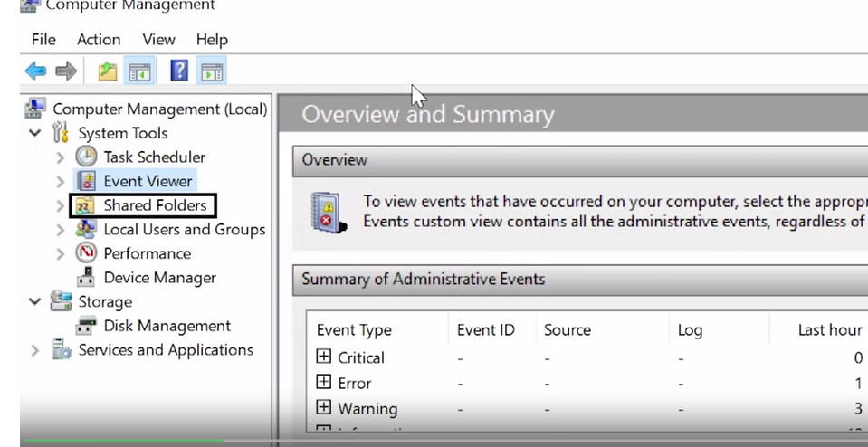

## COMPUTER MANAGEMENT
## Computer management tool.
To view user and group information in Windows -->  use the computer management tool. 


If we search computer management in our application search and open it up, we'll see a window that gives us a lot of information. 

 At the top of the sidebar, you'll see it says, computer management Local. This means we're managing a single machine locally. 
 
 In an enterprise environment, you can manage multiple machines in something called a domain. 
 A Windows domain is a network of computers, users, files, etc, that are added to a central database. 
 
 If you're an admin of that domain, you can view those accounts in computers from any machine in the domain. Underneath this menu, we have system tools. 
 
 
 ### Task scheduler. 
 This lets you schedule programs and tasks to run at certain times, like automatically shutting off the computer at 11:00 PM every night. 


 ### Event viewer. 
 This is where our system stores its system logs. 


 ### Shared folders. 
 This shows the folders that different users on the machine share with each other. Remember how we said that other users can view anyone else's files? That's not exactly true. If user store files on a shared folder, anyone who has access to that folder can view it. 


 ### Local users and groups. 
 This is where we'll be doing our user and group management. 
 
 
 ## Performance. 
 This shows monitoring for the resources of our machine, like CPU and RAM. 
 
 
 ### Device manager. 
 
 This is where we go to manage devices to our computer, like our network cards, sound cards, monitors, and more. Under the storage menu, we have a sub menu for disk management. 
 
 Finally, 
 ### Services and applications  
 shows us the programs and services that we have available on the system. We can choose to enable or disable services like DNS here, all the essential settings that we as administrators need to change are found in the computer management tool. 


 It's more efficient to use this than it is to go through the default settings application. 
 
 ## Storage
 

Under users, we can see a few built-in Windows accounts, like guest and administrator. 
### The local administrator account 
lets you login using the administrator username and whatever the administrator password is on the computer. 


This account is disabled by default. Since this account it has unfettered access on the computer, it can be dangerous to be logged into it at all times. For now. Let's look at the account I'm in. Cindy. 

double-click on this to see more information. 

Under the tab general, we can see some basic information about the user, along with some options. 


# CLI

use the CLI to quickly see the list of users on the computer using the command, Get-LocalUser.

``` PowerShell
    // lists my user account 
    Get-LocalUser
```
As you can see, it lists my user account, a few other users, and a couple of other default accounts that are part of windows. Here you can see that my local administrator account isn't enabled. That's way easier. 

What about groups?  
``` PowerShell
    // list the groups on the local machine. 
    Get-LocalGroup
```
Get-LocalGroup will list the groups on the local machine. 


to see members in this group with Get-LocalGroupMember
``` PowerShell
    // see members in this group 
    Get-LocalGroupMember
```


If your organization has a lot of windows machines, it's very common to use Active Directory to manage user accounts in a central directory service.


