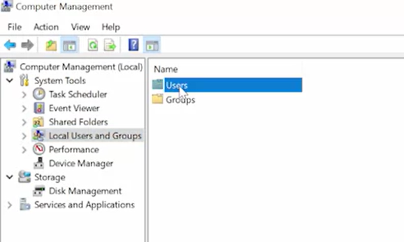
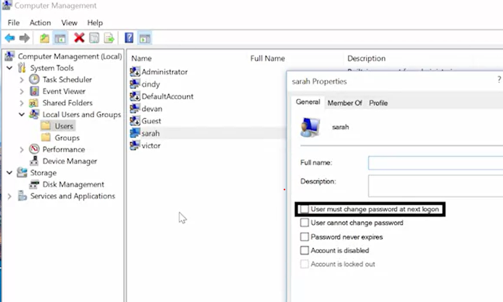
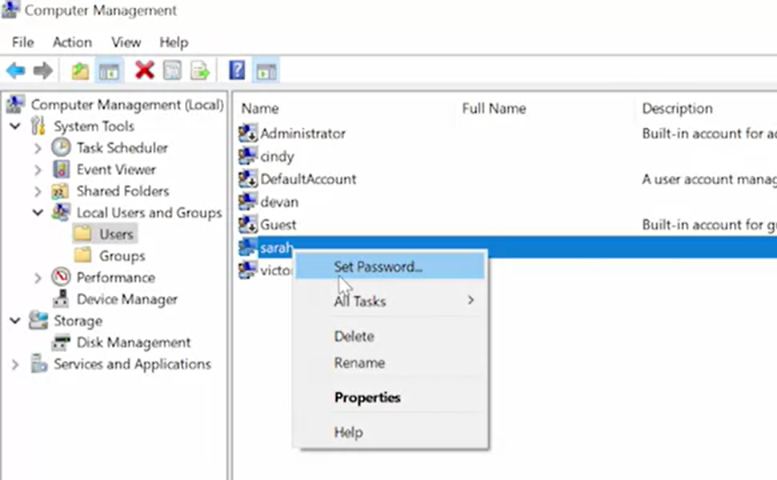
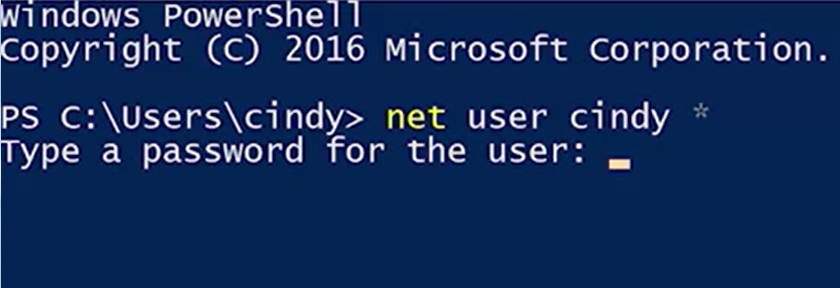
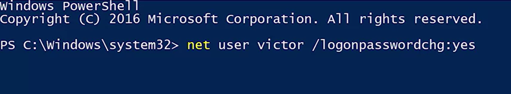

# PASSWORD

working with passwords. 

Passwords add security to our user accounts and machines. They make it so that only User knows the magic secret to access your account and no one else's, not even the admin of the computer. 

When setting up a password, you want to make sure that you and only you know that password. 

Remember, if you're managing other people's accounts on a machine, you shouldn't know what their password is. Instead, you want the user to enter the password themselves. 

## GUI

computer management tool


- Under local users and groups, we're going to right-click on a username 
- click on "Properties" 

- check this box that says, "User must change password at next login".
- Apply and hit "Okay". Then when the user logs into the account, they'll be forced to change their password. 

If they forgot their password, you have the option to set a password for the manually by 

- right-clicking and selecting "Set password". This has some caveats though like losing access to certain credentials. 

## CLI

To change a local password and PowerShell, use the DOS style ***Net*** command. 

There's a native PowerShell command that can be used to set the password but it's a little more complicated. It requires a bit of simple scripting to use. For now, we'll stick to the simpler, though less powerful Net command. 

Net does lots of different things. Changing local user passwords is just one of them. Since this is an old DOS style command, you can also use the *** /? *** mark parameter to get help on the command from the CLI. To change a password for user, the command is net user then the username and password.
``` Powershell
    net user cindy "some pass"
```


The best way to use this command is to use an asterisk instead of writing your password out on the command line.
``` Powershell
    net user cindy *
```

If you use an asterisk, net will pause and ask you to enter your password like so.
Then we're going do what we did in the GUI and force the user to change the default password on their next log on using the /login password change;yes parameter. 
``` Powershell
    net user victor/logonpasswordchange:yes
```

